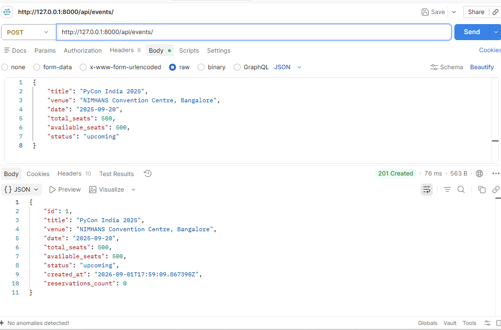
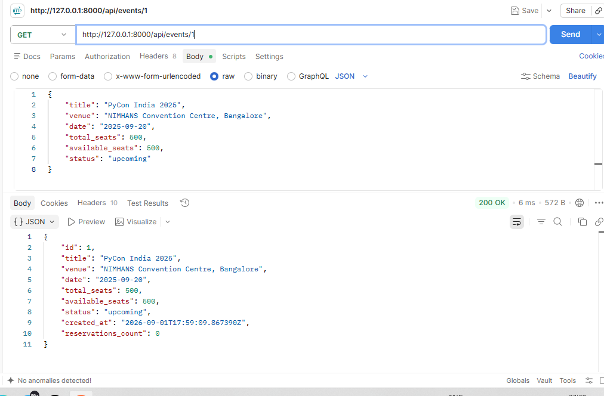
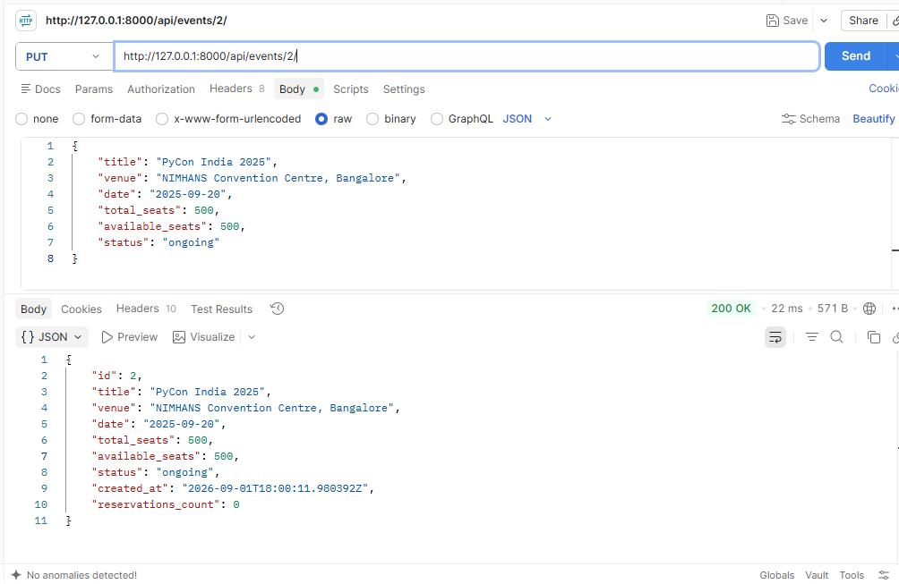
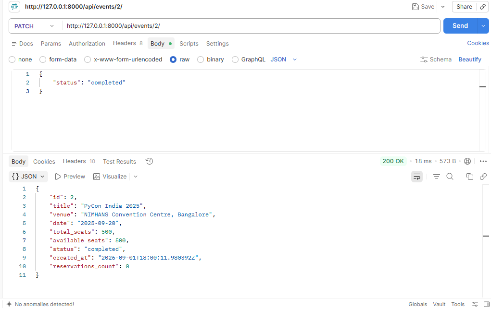
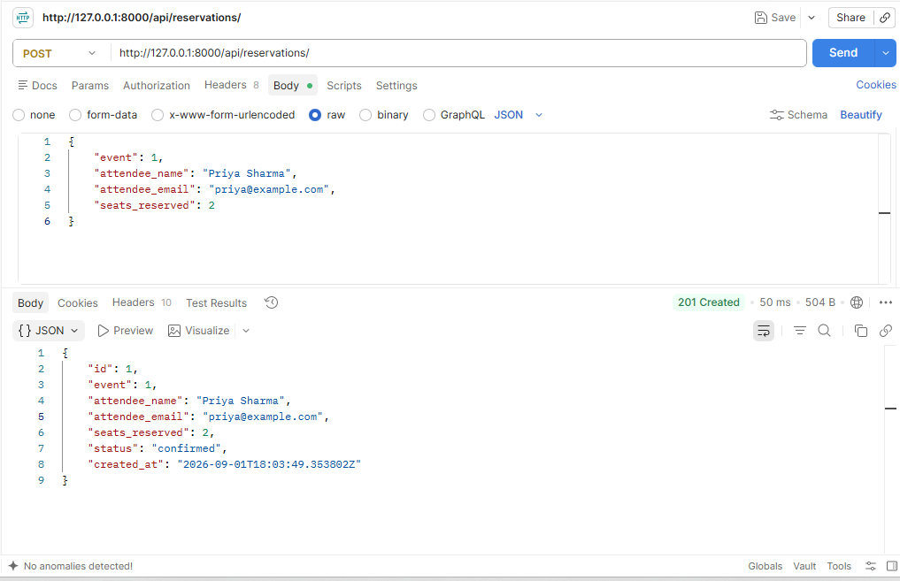
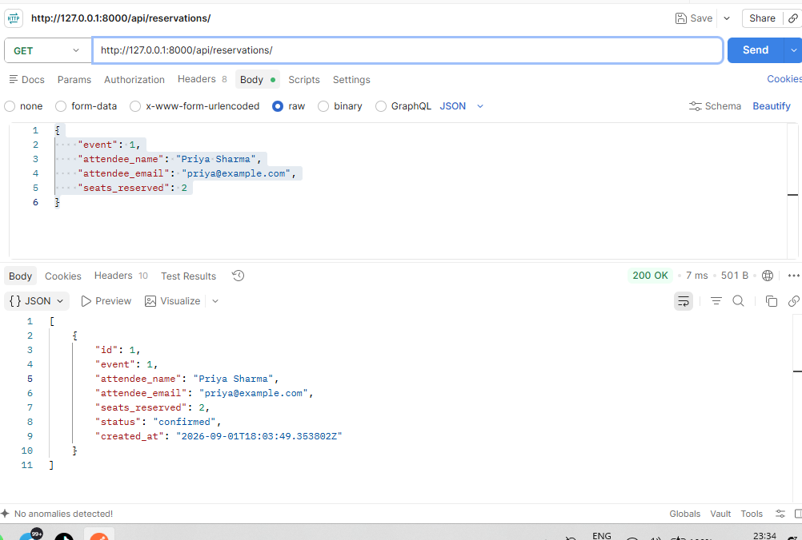
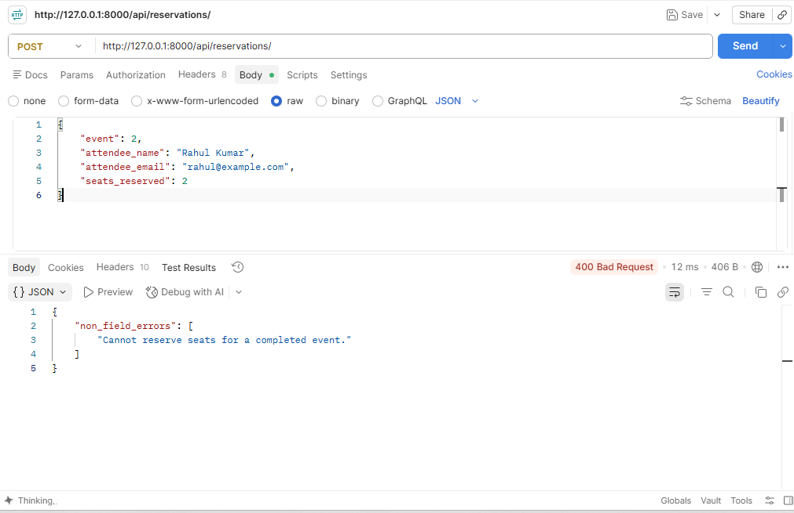
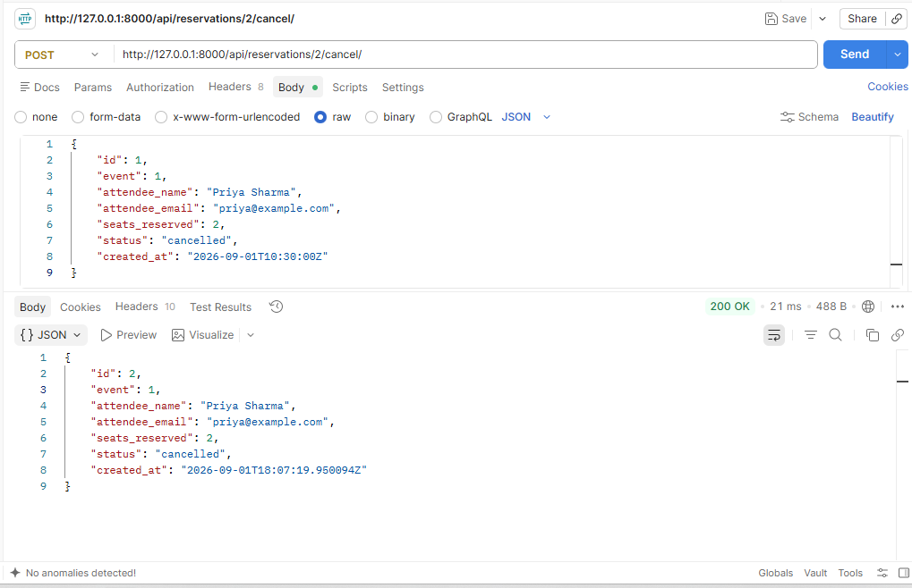

# EventHub

EventHub is a simple Django REST Framework backend for a ticketing platform.

Users can:
- browse events
- reserve seats
- cancel reservations

## Tech Stack

- Python
- Django
- Django REST Framework
- SQLite

## Setup

### 1. Clone the repository

```bash
git clone <YOUR_GITHUB_REPOSITORY_URL>
cd eventhub
```

### 2. Create virtual environment

```bash
python -m venv .venv
```

### 3. Activate virtual environment

Windows PowerShell:

```powershell
.venv\Scripts\Activate.ps1
```

Windows Command Prompt:

```bat
.venv\Scripts\activate.bat
```

### 4. Install dependencies

```bash
pip install -r requirements.txt
```

### 5. Run migrations

```bash
python manage.py migrate
```

### 6. Start the server

```bash
python manage.py runserver
```

The API is available at:

```text
http://127.0.0.1:8000/api/
```

## Endpoints

### Events

- `GET /api/events/` - list events
- `GET /api/events/{id}/` - get one event
- `POST /api/events/` - create an event
- `PUT /api/events/{id}/` - update an event
- `PATCH /api/events/{id}/` - partially update an event
- `DELETE /api/events/{id}/` - delete an event
- `GET /api/events/?status=upcoming` - filter events by status
- `GET /api/events/?venue=bangalore` - filter events by venue

### Reservations

- `GET /api/reservations/` - list reservations
- `GET /api/reservations/{id}/` - get one reservation
- `POST /api/reservations/` - create a reservation
- `PUT /api/reservations/{id}/` - update a reservation
- `PATCH /api/reservations/{id}/` - partially update a reservation
- `DELETE /api/reservations/{id}/` - delete a reservation
- `GET /api/reservations/?event_id=1` - filter reservations by event
- `POST /api/reservations/{id}/cancel/` - cancel a reservation

## Design Decision

Reservation seat deduction is handled inside `ReservationSerializer.create()`.

When a reservation is created, the event's `available_seats` is reduced and the reservation is created from the same place in the code.

For this assignment, this simple approach is sufficient.

## Postman Screenshots

### Successful Event creation


### Get Events List


### update event


### PATCH


### Successful Reservation



### GET LIST OF RESERVATIONS



### completed event 



### Successful Cancellation



## Project Structure

```text
eventhub/
├── manage.py
├── requirements.txt
├── README.md
├── config/
└── events/
```
